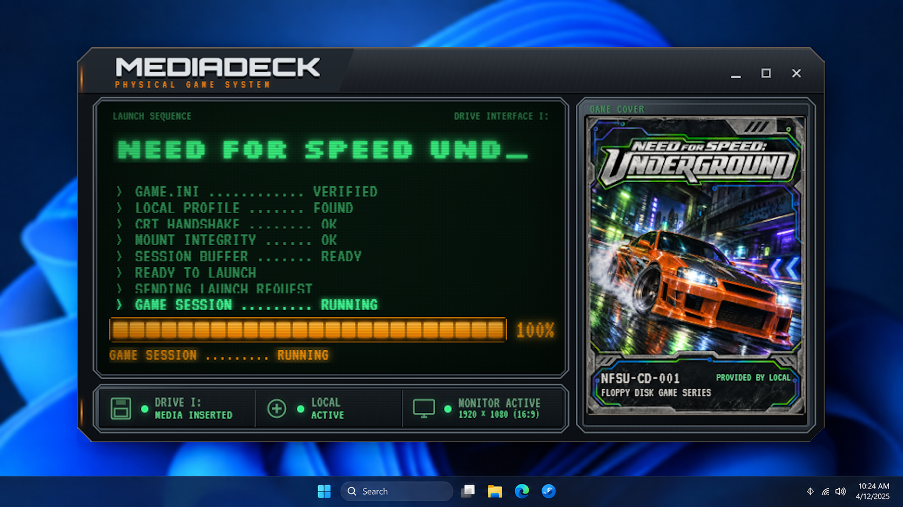

# MediaDeck

MediaDeck turns physical media into collectible launch keys for games installed
on a Windows PC. A floppy disk, CD, or DVD stores only a small `GAME.INI`
manifest; the game itself remains installed normally on the computer.



## How it works

1. Create a local launch profile for a Steam game or executable.
2. Generate a `GAME.INI` and place it on supported physical media.
3. Insert the media into a configured drive.
4. MediaDeck validates the manifest, presents the cover through its retro
   launcher, and starts the game automatically.
5. Removing the media requests that the bound game process close and escalates
   according to the configured shutdown policy.

## Highlights

- Steam library discovery and manually registered Windows executables.
- Configurable Steam launch options such as
  `steam://launch/APP_ID/optionN`.
- Strict, portable `GAME.INI` parsing with bounded input.
- Local cover-art cache with PNG, JPEG, and WebP validation.
- Runtime launcher with synchronized cover loading and animation.
- Physical drive allow-list and background monitoring.
- Automatic game-process binding and media-ejection shutdown.
- Label Studio for printable physical-media artwork.
- Tray mode and optional per-user Windows autostart.
- Sanitized diagnostics, rotating logs, verified backup, and staged restore.
- Offline-first operation with no Steam credentials or API key required.

## Technology

- Tauri 2 and Rust
- React 19 and TypeScript
- SQLite through SQLx
- Native Windows device, process, registry, tray, and optical-media APIs

## Build

Requirements:

- Windows 10 or Windows 11 x64
- Node.js 24
- pnpm 11
- Rust 1.85 or newer with the MSVC toolchain
- Microsoft Edge WebView2 Runtime

Install dependencies and run in development:

```powershell
corepack pnpm install
corepack pnpm tauri dev
```

Build the release executable and NSIS installer:

```powershell
corepack pnpm tauri build
```

Generated artifacts:

```text
src-tauri\target\release\media-deck.exe
src-tauri\target\release\bundle\nsis\MediaDeck_0.1.0_x64-setup.exe
```

The release executable is self-contained and can be copied independently. User
data is stored under `%LOCALAPPDATA%\MediaDeck`, not beside the executable.

## Project status

Phases 1–11 are implemented in code and packaging configuration. Gate M5 still
needs a human clean-VM install/uninstall pass (`docs/RELEASE_MATRIX.md`).
Hardware-in-loop checks from earlier milestones remain operator-owned.

Release packaging helper:

```powershell
.\scripts\release\Build-Release.ps1 -Version 0.1.0
```

See `docs/PACKAGING.md` for NSIS, WebView2, updater-disabled policy, signing,
and residual risks.

## Project documents

- [Product specification](docs/PRODUCT_SPEC.md)
- [Implementation plan](docs/IMPLEMENTATION_PLAN.md)
- [Session handoff](docs/SESSION_HANDOFF.md)

The versioned artwork-generation skill remains available under
[`docs/skills/mediadeck-media-artwork`](docs/skills/mediadeck-media-artwork/).
